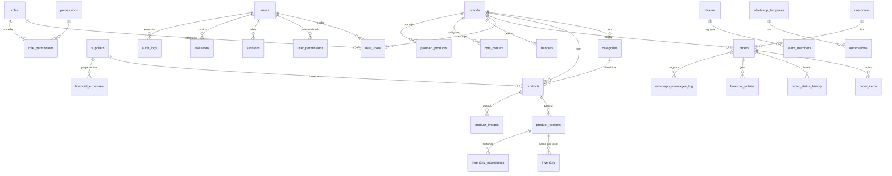

# FC-BRA — Auditoria e arquitetura

Entregáveis das fases 0 e 1 do plano (§41): relatório de auditoria, decisão de
arquitetura, diagrama de entidades e plano de implementação.

## Fase 0 — Auditoria do ambiente

| Item | Resultado |
|---|---|
| Arquivos existentes | Projeto novo (repositório `FC-BRA` vazio). Nada a preservar. |
| Projetos do usuário | `COMUNICA-`, `HP-BARBER-STUDIO` e os projetos Supabase existentes **não foram alterados**. |
| Stack instalada | Nenhuma. Stack proposta conforme §29.1. |
| Banco e migrations | Nenhum. Criado em `supabase/migrations/`. |
| `.env.example` | Criado, com todas as variáveis documentadas. |
| Hospedagem | Netlify (pedido do usuário) em vez de Vercel (§29.1 permite “ambiente do usuário”). |
| Supabase | A organização do usuário já tem 2 projetos ativos (limite do plano gratuito). Para não pausar nem alterar projetos existentes, o sistema sobe em **modo demonstração** e passa a usar o Supabase quando `DATABASE_URL` for configurada. |

### Riscos e decisões

| Risco | Decisão / mitigação |
|---|---|
| Sem banco de produção no primeiro deploy | Modo demonstração com PostgreSQL embutido (PGlite) e o **mesmo** esquema/regras; snapshot inicial gerado no build (carga em ~1 s); estado persistido em Netlify Blobs. Aviso permanente no painel. |
| Timeout de funções serverless no 1º acesso | Snapshot DEMO pré-gerado no build; inicialização do banco no `instrumentation` (fora da requisição). |
| Revogação de acesso “em tempo real” (§35.8) | Autenticação própria com sessões no banco (token aleatório em cookie httpOnly; no banco só o hash). Toda requisição valida a sessão — revogar apaga o acesso na hora. Supabase Auth (JWT) manteria tokens válidos até expirar. |
| Escalonamento de privilégio | Ninguém concede permissão que não possui; ninguém altera os próprios papéis; papel ADMINISTRADOR_PRINCIPAL é fixo. Testado em `tests/rbac.test.ts`. |
| Inconsistência pedido × estoque × financeiro (§37) | Mudança de status em transação única com `SELECT … FOR UPDATE`; baixa/estorno de estoque e receita/estorno financeiros derivados do status. |
| Pedido duplicado (duplo clique) | Chave de idempotência por envio (`orders.idempotency_key` único). |
| Preço adulterado no navegador | O servidor recalcula preços, frete e totais a partir do banco. |
| Envio falso de WhatsApp (§28.12) | Sem API configurada o sistema só gera link `wa.me` e registra `delivery_method = link`. |
| Dados inventados (§40) | Campos vazios exibem “Não informado” / “Configuração pendente”. DEMO sempre marcado (`is_demo`) e removível. |

## Fase 1 — Arquitetura

### Visão geral

```
Navegador ──► Next.js (Netlify Functions)
               ├─ Loja (Server Components) ──► serviços de catálogo/pedidos
               ├─ Painel (Server Components + Server Actions) ──► RBAC ──► serviços
               ├─ APIs: /api/events, /api/media, /api/admin/*
               └─ Middleware: bloqueia /admin sem sessão
serviços ──► Drizzle ORM ──► PostgreSQL (Supabase) | PGlite (demonstração)
mídia    ──► Netlify Blobs (imagens enviadas pelo painel)
WhatsApp ──► LinkDriver (wa.me) | CloudApiDriver (Meta Cloud API)
```

### Pastas

| Caminho | Conteúdo |
|---|---|
| `supabase/migrations/` | `0001` esquema, `0002` dados-base (marcas, categorias, papéis, permissões, modelos de mensagem, CMS com placeholders), `0003` segurança (`has_permission()` + RLS) |
| `src/server/db/` | Conexão (postgres.js / PGlite), esquema Drizzle, aplicador de migrations, carga DEMO |
| `src/server/auth/` | Hash de senha (scrypt), tokens, sessões |
| `src/server/rbac.ts` | Permissões efetivas (papéis × marca + permissões avulsas) |
| `src/server/services/` | Catálogo, pedidos, estoque, financeiro, clientes, relatórios, analytics, WhatsApp, usuários, CMS, dashboard |
| `src/server/resources.ts` | Cadastros simples descritos por configuração (fornecedores, ideias, banners…) |
| `src/app/[brand]/` | Loja de cada marca (URLs `/fina-classica/vestidos/...`, `/bravus/camisas/...`) |
| `src/app/admin/` | Painel |

### Autenticação e RBAC

- Sessão: cookie `__Host-fcbra_session` (httpOnly, secure, sameSite=lax), 12 h, validada no banco a cada requisição.
- Senhas: scrypt com sal. CPF: apenas hash + 2 últimos dígitos (exibição mascarada).
- Rate limit no banco (login, checkout, convites, eventos, upload).
- Permissão = **módulo × ação** (19 módulos × 9 ações). Papel atribuído com escopo:
  `brand_id NULL` (ambas) ou uma marca. Papel PERSONALIZADO usa `user_permissions`.
- Toda Server Action valida sessão + permissão + marca do registro; toda ação
  administrativa grava `audit_logs` (quem, o quê, quando, antes/depois, motivo).
- RLS habilitado em todas as tabelas: a chave pública do Supabase só lê o catálogo
  publicado; usuários autenticados via Supabase têm políticas por papel × marca com
  `has_permission(auth.uid(), módulo, ação, marca)`. Sessões, tokens e rate limit não
  têm política (inacessíveis pela API pública).

### Fluxo principal (§39)

```
cliente ─► marca ─► categoria ─► produto ─► variação ─► carrinho (por marca)
        ─► checkout ─► createOrder [transação: valida marca/estoque, recalcula preços,
           frete, cliente (cria/atualiza), pedido + itens + histórico, mensagem,
           log WhatsApp, evento, auditoria] ─► página de confirmação assinada ─► WhatsApp
admin   ─► status "Aguardando pagamento" ─► baixa de estoque (movimento "venda")
        ─► status "Pago" ─► receita no financeiro ─► dashboards e relatórios
        ─► "Cancelado/Devolvido" ─► estorno de estoque e financeiro
```

### Modelo de dados



Todas as tabelas têm chaves estrangeiras, índices nas colunas de busca/filtro,
*constraints* (unique, check, not null), `created_at`/`updated_at` e, onde faz
sentido, `deleted_at` (exclusão lógica) e `is_demo`.

### Plano de implementação

| Fase | Entrega | Situação |
|---|---|---|
| 0 Auditoria | Este documento | Concluída |
| 1 Arquitetura | Pastas, modelo de dados, RBAC, integrações | Concluída |
| 2 Banco | Migrations, constraints, índices, RLS, RBAC | Concluída |
| 3 Loja | Seleção de marca, catálogo, busca, filtros, produto, carrinho, checkout, WhatsApp, SEO | Concluída |
| 4 Painel | Todos os módulos do §3.2, RBAC completo, auditoria, CMS | Concluída |
| 5 Qualidade | Vitest (17 testes), Playwright (6 testes e2e), build | Concluída |
| 6 Operação | Conectar Supabase, preencher identidade/conteúdo, cadastrar produtos reais, limpar DEMO | Com o cliente |
| Futuro | Pagamento online, cálculo de frete por CEP, cupons, fidelidade, recuperação de carrinho, 2FA, fila de automações, multi-CD | Modelo preparado |
